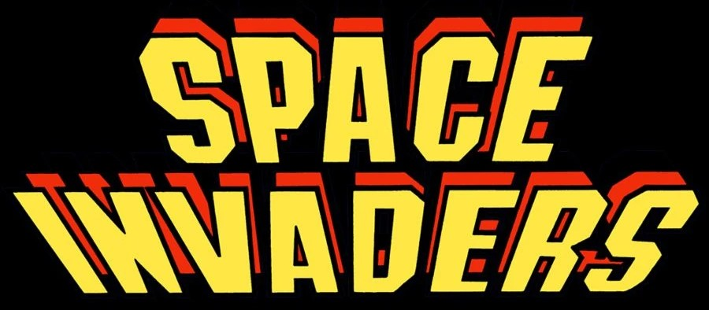

# Space Invaders

A console-based recreation of the classic arcade game with additional features.

https://github.com/user-attachments/assets/a5ca11d5-9a93-4d98-8285-29bbaaf78754

## Description

Space Invaders is a C++ implementation of the classic arcade game that includes both single-player and two-player PVP modes. The game features user account management, save/load functionality, and a leaderboard system.

## Key Features

- **Single-player mode** with progressive difficulty levels
- **PVP mode** allowing two players to compete against each other
- **User account system** for player authentication
- **Save/load functionality** to preserve game progress
- **Leaderboard system** to track high scores
- **ASCII art graphics** for visual representation
- **Shield mechanics** for player protection
- **Special enemy ships** that provide bonus points

## Game Architecture

The game follows a modular architecture organized into several core systems:

### Game Core
- Game Loop
- PVP Mode
- Input Handler

### Game Entities
- Player Ship
- Enemies
- Special Ship
- Shields
- Missiles

### User Management
- User Accounts
- Save/Load System
- Leaderboard

### User Interface
- Main Menu
- Pause Menu
- ASCII Art Assets

## Game Modes

### Single Player Mode
In single-player mode, you control a ship at the bottom of the screen and must defeat waves of alien invaders. The game features:
- Progressive difficulty levels
- Increasing enemy speed and shooting frequency
- Shield protection
- Special bonus ships

### PVP Mode
The competitive PVP mode allows two players to face each other:
- Two players controlling ships at opposite ends of the screen
- Defensive barriers for each player
- Lives system to determine the winner

## Controls

### Main Menu Navigation
- W/S: Move up/down in menu
- Enter: Select option

### In-Game Controls (Single Player)
- A/D: Move left/right
- Space: Shoot
- ESC: Pause game

### Pause Menu
- W/S: Navigate options
- Enter: Select option

## User Account System

The game includes a comprehensive user account system:
- Username and password authentication
- Account creation with validation
- Persistent storage via text files

## Save/Load System

Players can save and resume their progress:
- Score
- Level
- Time played
- Remaining lives

## Leaderboard System

The leaderboard ranks players based on:
1. Level reached (higher is better)
2. Time taken (lower is better)
3. Score (higher is better)

## Technical Implementation

- Console-based rendering with ASCII graphics
- Color-coded entities using ANSI escape sequences
- Frame-rate controlled rendering (60 FPS)
- Dynamic enemy behavior system
- Collision detection

## Installation

1. Clone the repository
2. Compile the source code using a C++ compiler
3. Run the executable

## License

This project is licensed under the MIT License - see the [LICENSE](LICENSE) file for details.

## Credits

Developed by *Aryan Ghasemi* & *Seyed Sadra Seyed Tabai*
